# Create MySQL HeatWave Database System


## Introduction

In this lab, you will create a Compartment, a Virtual Cloud Network, and create the MySQL HeatWave DB System with a HeatWave cluster.  

_Estimated Time:_ 20 minutes

### Objectives

In this lab, you will be guided through the following tasks:

- Create Compartment
- Create Virtual Cloud Network
- Create MySQL HeatWave (DB System) Instance

### Prerequisites

- An Oracle Trial or Paid Cloud Account
- Some Experience with MySQL Shell

## Task 1: Create Compartment

1. Click the **Navigation Menu**, navigate to **Identity & Security** and select **Compartments**.

2. On the Compartments page, click **Create Compartment**.

3. In the Create Compartment dialog box, complete the following fields:

    Name:

    ```bash
    <copy>automl</copy>
    ```

    Description:

    ```bash
    <copy>Compartment for AutoML with MySQL Database workshop</copy>
    ```

4. The **Parent Compartment** should be **automl** and click **Create Compartment**.
    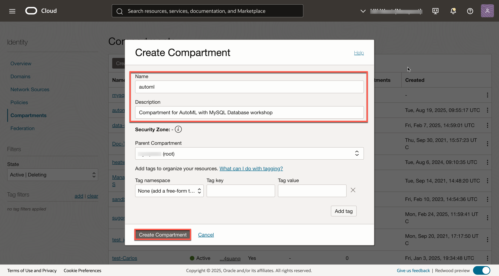

## Task 2: Create Virtual Cloud Network

1. You should be signed in to Oracle Cloud!

    Click **Navigation Menu**.

    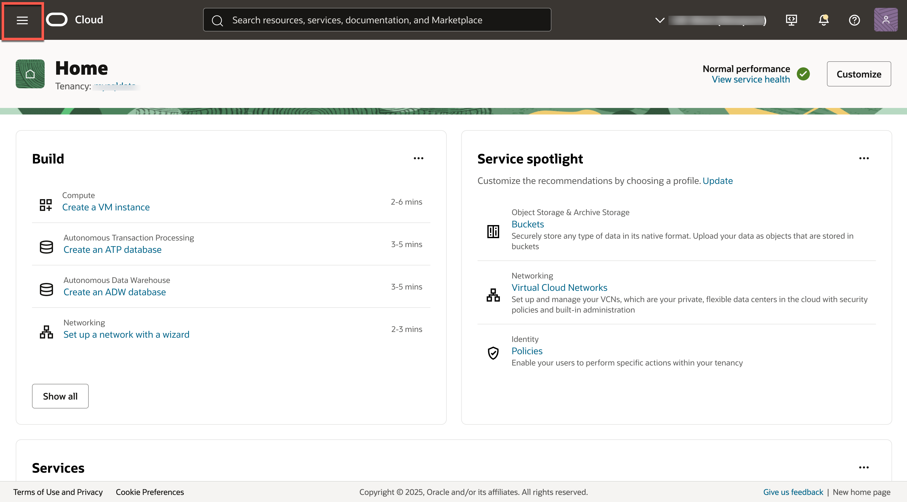

2. Click  **Networking**, then **Virtual Cloud Networks**.
    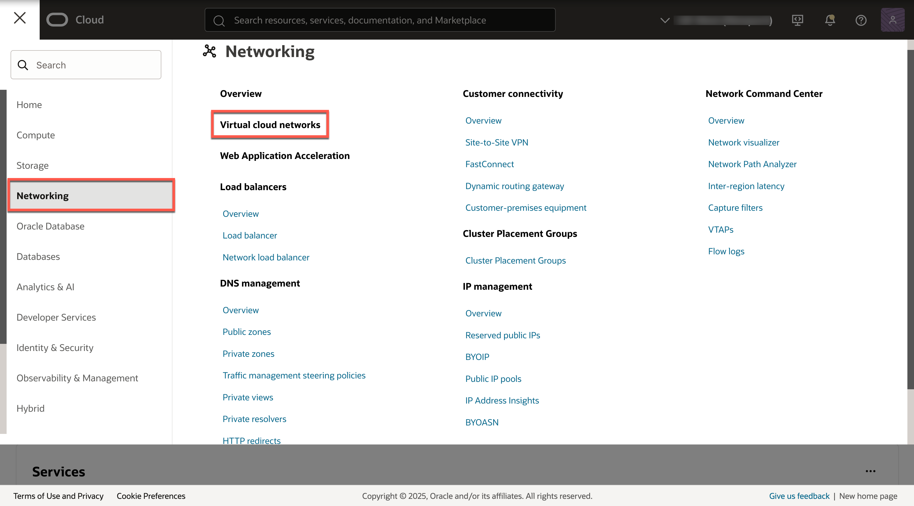

3. Click **Actions**, then **Start VCN Wizard**.
    

4. Select **Create VCN with Internet Connectivity**, then click **Start VCN Wizard**.
    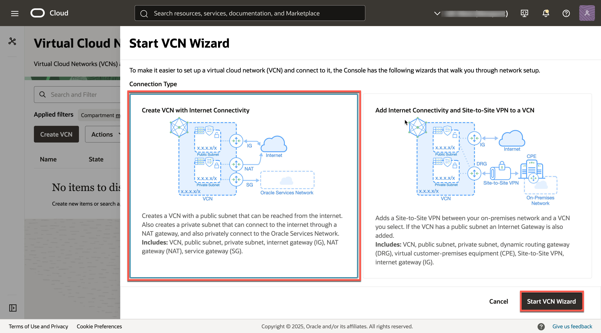

5. Under Basic Information, complete the following fields:

    VCN Name:

    ```bash
    <copy>HEATWAVE-VCN</copy>
    ```

    Compartment: Select  **automl**

    Your screen should look similar to the following:
    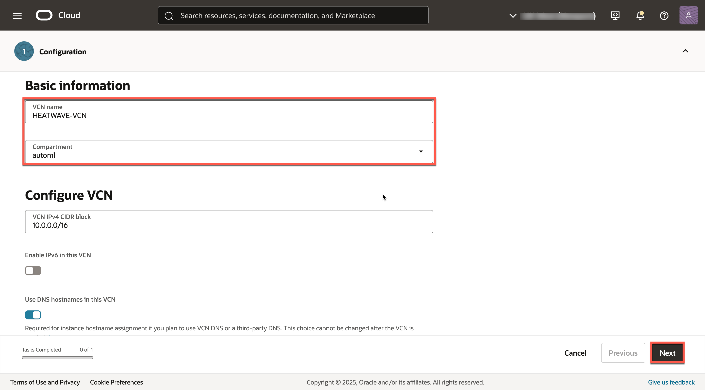

6. Click **Next** at the bottom of the screen.

7. Review Oracle Virtual Cloud Network (VCN), Subnets, and Gateways.

    Click **Create** to create the VCN.
    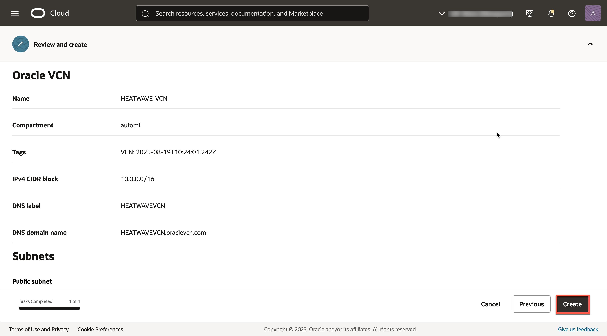

8. When the Virtual Cloud Network creation completes, click **View VCN** to display the created VCN.
    

## Task 3: Configure security list to allow MySQL incoming connections

1. On HEATWAVE-VCN page, click **Subnets**.

2. Under Applied filters select the **automl** compartment.

3. Click  **private subnet-heatwave-vcn**.
     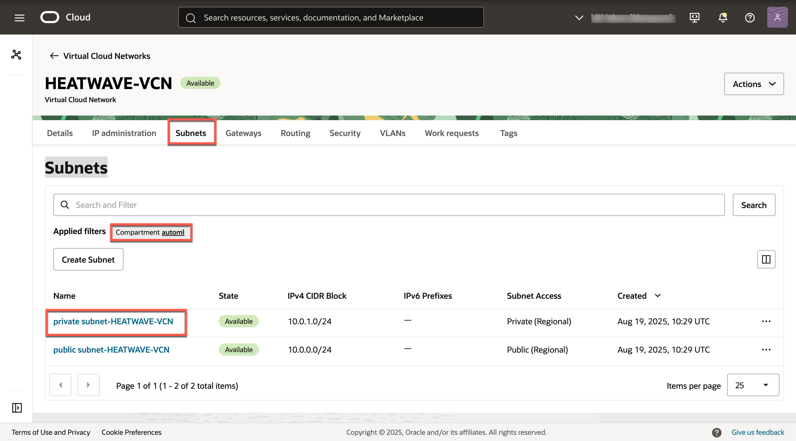

4. On the Private Subnet-HEATWAVE-VCN page, click **Security**.

5. Under Security Lists,  click  **security list for private subnet-HEATWAVE-VCN**.
    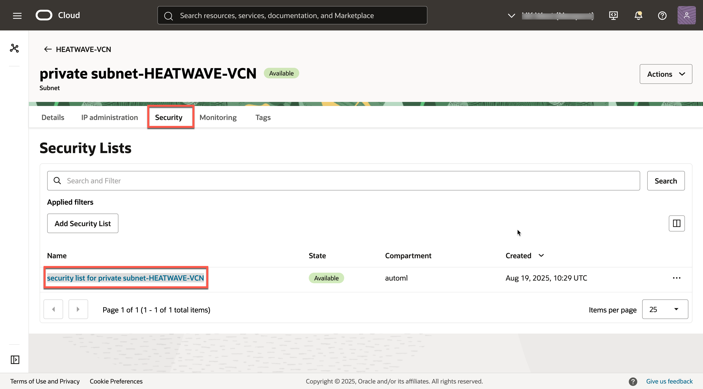

6. On the security List for Private Subnet-HEATWAVE-VCN page, click **Security rules**.

7. Under Ingress Rules, click **Add Ingress Rules**
    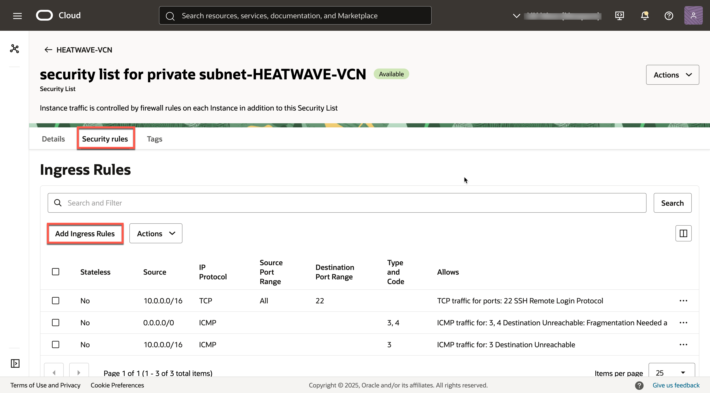

8. On the Add Ingress Rules page under Ingress Rule:

    Add an Ingress Rule with Source CIDR

    ```bash
    <copy>0.0.0.0/0</copy>
    ```

    Destination Port Range

    ```bash
    <copy>3306,33060</copy>
    ```

    Description

    ```bash
       <copy>MySQL Port Access</copy>
    ```

9. Click **Add Ingress Rule**.
    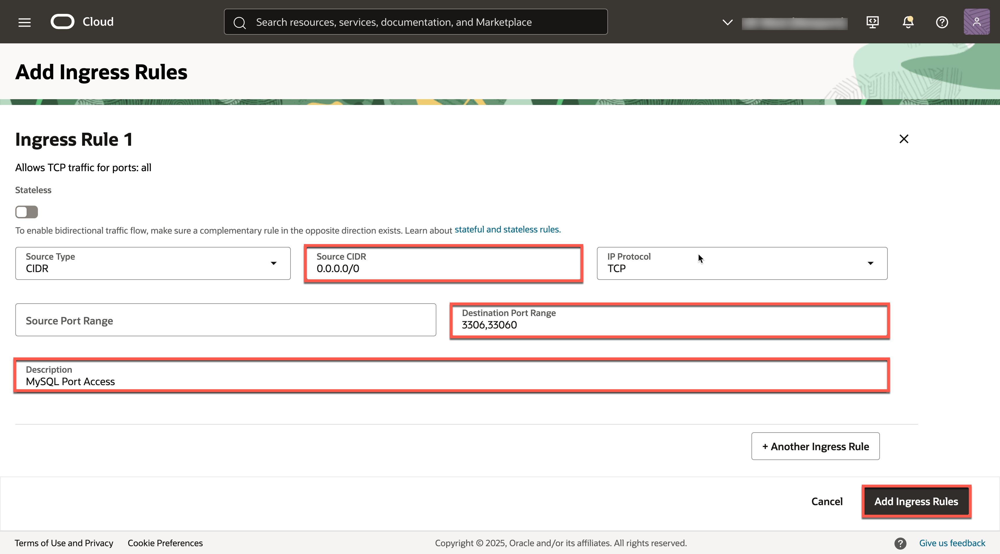

10. On Security rules tab of the security List for Private Subnet-HEATWAVE-VCN page, the new Ingress Rules are shown under the Ingress Rules list.
    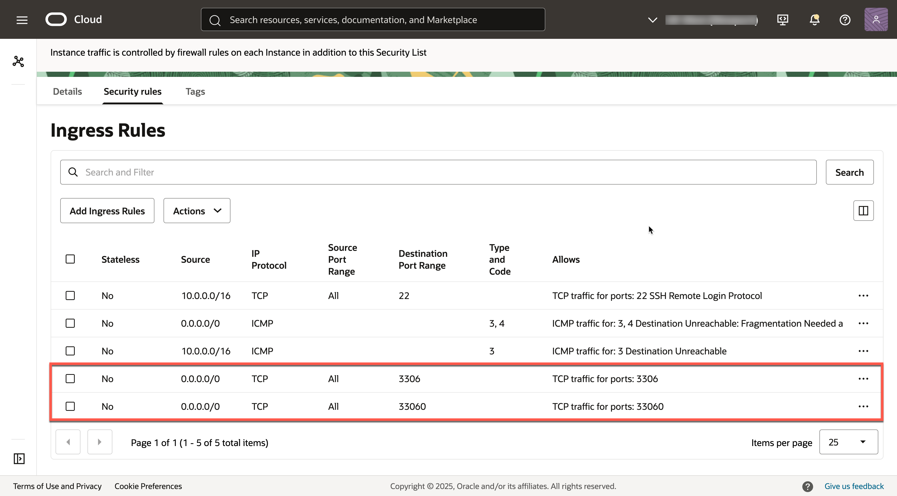

## Task 4: Configure security list to allow HTTP incoming connections

1. Navigation Menu > Networking > Virtual Cloud Networks.

2. Open **HeatWave-VCN**.

3. Click **Subnets**, then click **public subnet-HeatWave-VCN**.

4. Click **Security**, then click **Default Security List for HeatWave-VCN**.

5. Click **Security rules**, then under Ingress Rules click **Add Ingress Rules**.

    Add an Ingress Rule with Source CIDR

    ```bash
    <copy>0.0.0.0/0</copy>
    ```

    Destination Port Range

    ```bash
    <copy>80,443</copy>
    ```

    Description

    ```bash
    <copy>Allow HTTP connections</copy>
    ```

6. Click **Add Ingress Rule**.

    

7. On the Security rules tab of the Default Security List for HEATWAVE-VCN page, the new Ingress Rules are shown under the Ingress Rules list.

    

## Task 5: Create MySQL Database for HeatWave (DB System) instance

1. Click on Navigation Menu > Databases > MySQL HeatWave.
    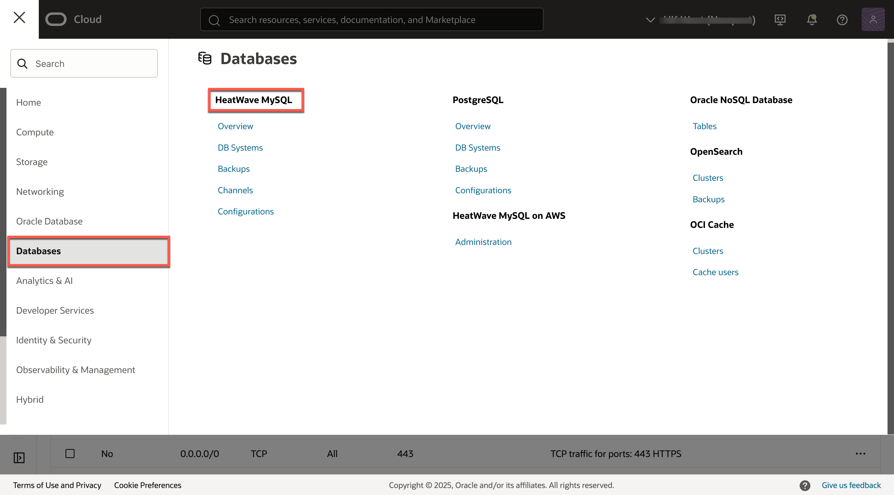

2. Click **Create DB System**.
    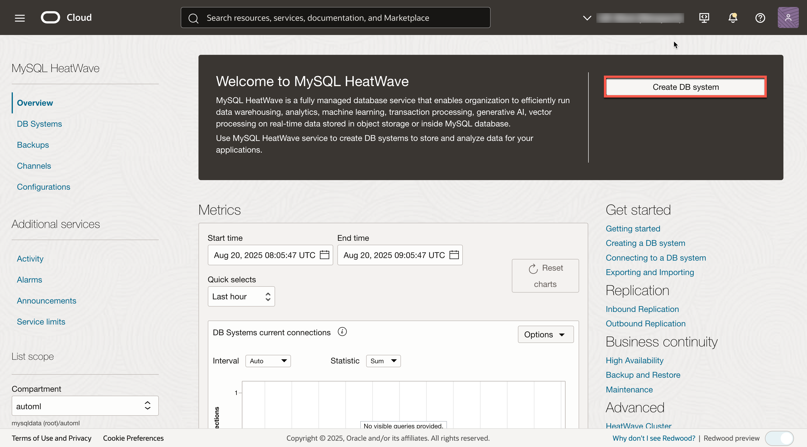

3. Create MySQL DB System dialog by completing the fields in each section:

    - Provide DB System information
    - Setup the DB system
    - Create Administrator credentials
    - Configure Networking
    - Configure placement
    - Configure hardware
    - Exclude Backups
    - Set up Advanced Options

4. For DB System Option Select **Development or Testing**.

    

5. Provide basic information for the DB System:

    a. Select Compartment **automl**

    b. Enter Name

    ```bash
    <copy>HEATWAVE-DB</copy>
    ```

    c. Enter Description

    ```bash
    <copy>MySQL HeatWave Database Instance</copy>
    ```

    d. Create Administrator Credentials:

    **Enter Username** (write username to notepad for later use)

    **Enter Password** (write password to notepad for later use)

    **Confirm Password** (value should match password for later use)

    

6. Select **“Standalone”**.
    
7. On Configure networking, select these values:

    a. Virtual Cloud Network: **HEATWAVE-VCN**

    b. Subnet: **private Subnet-HEATWAVE-VCN (Regional)**

    c. On Configure placement, select **AD-1** under Availability Domain. Do not check **Choose a Fault Domain** for this DB System.

    

8. On Configure Hardware, keep default values.

    For Storage Size, set **Initial data storage size (GB)** value to:  **1024**

    ```bash
    <copy>1024</copy>
    ```

    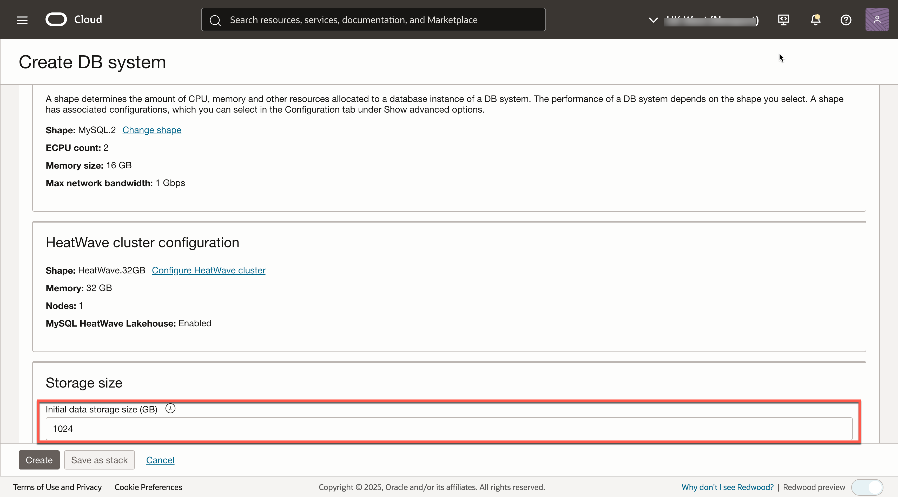

9. On Configure backup plan, disable **Enable Automatic Backup**.

    

10. Click **Show advanced options**.

11. Expand Connections, then in the **Hostname** field enter (same as DB System Name):

    ```bash
        <copy>HEATWAVE-DB</copy> 
    ```  

    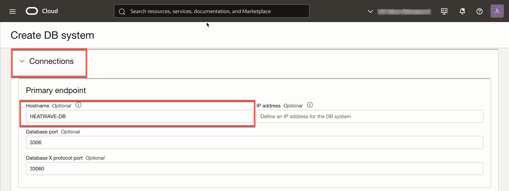

12. Review **Create MySQL DB System**  screen, then click **Create**.

    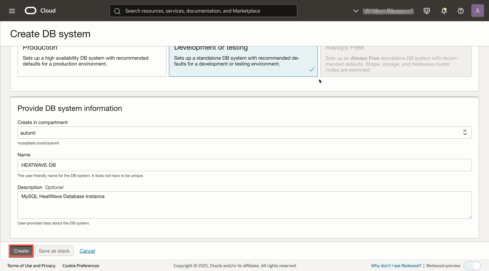

13. The New MySQL DB System will be ready to use after a few minutes.

    The state is shown as 'Creating' during the creation.
    

14. The state 'Active' indicates that the DB System is ready for use.

    On HEATWAVE-DB Page, click **Connections**, and then check the Primary endpoint (**Private IP Address**).

    

You may now **proceed to the next lab**.

## Acknowledgements

- **Author** - Perside Foster, MySQL Solution Engineering

- **Contributors** - Mandy Pang, MySQL Principal Product Manager,  Priscila Galvao, MySQL Solution Engineering, Nick Mader, MySQL Global Channel Enablement & Strategy Manager, Frédéric Descamps, MySQL Community Manager

- **Last Updated By/Date** - Perside Foster, MySQL Solution Engineering,January 2025
